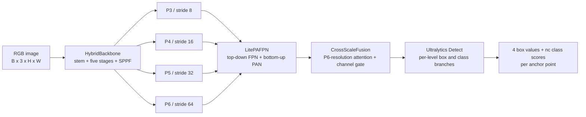

# LightEdgeDet architecture: nano and small

This document describes the LightEdgeDet implementation in this Ultralytics fork, with an exact comparison of the nano
and small models. It follows the code paths used to construct, train, validate, predict, fuse, and optionally distill the
models. The custom network is implemented in `ultralytics/nn/modules/lightedgedet.py` and assembled by
`LightEdgeDetModel` in `ultralytics/nn/tasks.py`.

The small-model values in this document reflect the current working configuration:

```yaml
backbone_channels: [72, 144, 272, 368, 432]
```

That working-tree value supersedes the committed `[56, 142, 216, 368, 432]` line. Parameter and FLOP figures were
measured from the current configuration at 640 x 640 rather than copied from the comments at the top of the YAML files.

## 1. System position

LightEdgeDet is a four-scale, anchor-free object detector. Its data path is:



The implementation does not use the normal Ultralytics `backbone:` and `head:` layer lists or `parse_model()`. Flat
LightEdgeDet YAML keys are read directly by `LightEdgeDetModel`, which owns three top-level modules:

```text
LightEdgeDetModel
├── backbone: HybridBackbone
├── neck: LitePAFPN
└── model
    └── detect: Detect
```

Only the head is placed inside `self.model`. This preserves the Ultralytics loss contract that expects
`model.model[-1]` to be a `Detect` instance. The backbone and neck remain registered child modules, so they participate
in `state_dict()`, device moves, optimization, and checkpoint loading.

## 2. Nano and small at a glance

Both variants have the same five-stage depth schedule, expansion ratios, squeeze-excitation ratios, kernel schedule,
four detection strides, and standard detection head. They differ in channel width, attention placement, and neck depth.

| Setting                  |                        Nano |                       Small |
| ------------------------ | --------------------------: | --------------------------: |
| Config                   |    `lightedgedet_nano.yaml` |   `lightedgedet_small.yaml` |
| Stem channels            |                          20 |                          36 |
| Backbone channels        |   `[37, 74, 140, 196, 244]` |  `[72, 144, 272, 368, 432]` |
| Backbone depths          |           `[2, 3, 4, 3, 2]` |           `[2, 3, 4, 3, 2]` |
| Expansion ratios         | `[2.5, 2.5, 3.0, 3.5, 4.0]` | `[2.5, 2.5, 3.0, 3.5, 4.0]` |
| SE ratios                |       `0.25` at every stage |       `0.25` at every stage |
| Attention stages         |   stages 3 and 4: P5 and P6 |            stage 4: P6 only |
| Depthwise kernels        |           `[3, 3, 3, 7, 7]` |           `[3, 3, 3, 7, 7]` |
| Maximum drop-path rate   |                         0.1 |                         0.1 |
| Neck width               |                         104 |                         196 |
| Blocks per FPN/PAN level |                           3 |                           4 |
| Head type                |           standard `Detect` |           standard `Detect` |
| `reg_max`                |                           1 |                           1 |
| Detection strides        |           `[8, 16, 32, 64]` |           `[8, 16, 32, 64]` |
| End-to-end mode          |                       false |                       false |

At 640 x 640 with 80 classes, both models produce 8,500 anchor-point predictions:

\[
80^2 + 40^2 + 20^2 + 10^2 = 8{,}500.
\]

The decoded inference tensor has shape `B x 84 x 8500`: four box coordinates and 80 sigmoid class probabilities.

## 3. Shape ledger

The stem and the first block in every backbone stage downsample by two. Stage 0 is an internal stride-4 feature and is
not returned to the neck. Stages 1 through 4 become P3 through P6.

### 3.1 Nano tensors at 640 x 640

| Location     | Operation                                        | Stride | Tensor shape                   |
| ------------ | ------------------------------------------------ | -----: | ------------------------------ |
| Input        | RGB image                                        |      1 | `B x 3 x 640 x 640`            |
| Stem         | 3 x 3 convolution, stride 2                      |      2 | `B x 20 x 320 x 320`           |
| Stage 0      | 2 `LiteBlock`s                                   |      4 | `B x 37 x 160 x 160`           |
| Stage 1 / P3 | 3 `LiteBlock`s                                   |      8 | `B x 74 x 80 x 80`             |
| Stage 2 / P4 | 4 `LiteBlock`s                                   |     16 | `B x 140 x 40 x 40`            |
| Stage 3 / P5 | downsampling `LiteBlock`, `LitePSA`, `LiteBlock` |     32 | `B x 196 x 20 x 20`            |
| Stage 4 / P6 | downsampling `LiteBlock`, `LitePSA`, then SPPF   |     64 | `B x 244 x 10 x 10`            |
| Neck P3      | lateral/FPN/PAN/fusion                           |      8 | `B x 104 x 80 x 80`            |
| Neck P4      | lateral/FPN/PAN/fusion                           |     16 | `B x 104 x 40 x 40`            |
| Neck P5      | lateral/FPN/PAN/fusion                           |     32 | `B x 104 x 20 x 20`            |
| Neck P6      | lateral/FPN/PAN/fusion                           |     64 | `B x 104 x 10 x 10`            |
| Head         | box and class branches                           |    all | `B x 84 x 8500` after decoding |

### 3.2 Small tensors at 640 x 640

| Location     | Operation                                      | Stride | Tensor shape                   |
| ------------ | ---------------------------------------------- | -----: | ------------------------------ |
| Input        | RGB image                                      |      1 | `B x 3 x 640 x 640`            |
| Stem         | 3 x 3 convolution, stride 2                    |      2 | `B x 36 x 320 x 320`           |
| Stage 0      | 2 `LiteBlock`s                                 |      4 | `B x 72 x 160 x 160`           |
| Stage 1 / P3 | 3 `LiteBlock`s                                 |      8 | `B x 144 x 80 x 80`            |
| Stage 2 / P4 | 4 `LiteBlock`s                                 |     16 | `B x 272 x 40 x 40`            |
| Stage 3 / P5 | 3 `LiteBlock`s                                 |     32 | `B x 368 x 20 x 20`            |
| Stage 4 / P6 | downsampling `LiteBlock`, `LitePSA`, then SPPF |     64 | `B x 432 x 10 x 10`            |
| Neck P3      | lateral/FPN/PAN/fusion                         |      8 | `B x 196 x 80 x 80`            |
| Neck P4      | lateral/FPN/PAN/fusion                         |     16 | `B x 196 x 40 x 40`            |
| Neck P5      | lateral/FPN/PAN/fusion                         |     32 | `B x 196 x 20 x 20`            |
| Neck P6      | lateral/FPN/PAN/fusion                         |     64 | `B x 196 x 10 x 10`            |
| Head         | box and class branches                         |    all | `B x 84 x 8500` after decoding |

These dimensions assume an input divisible by 64. The neck interpolates to the receiving tensor's exact shape, while the
normal Ultralytics image-size check rounds training sizes to a valid maximum-stride multiple.

## 4. Hybrid backbone

`HybridBackbone` combines depthwise-separable convolution, squeeze-excitation, reparameterized depthwise kernels,
selected self-attention, stochastic depth, and SPPF. It returns `[P3, P4, P5, P6]`, finest to coarsest.

### 4.1 Stem and stage construction

The stem is a bias-free 3 x 3 stride-2 convolution followed by batch normalization and SiLU. For each stage, the builder
reads parallel values for output channels, depth, expansion, SE ratio, attention, and kernel size. Block 0 uses stride 2.
Later blocks use stride 1 and can carry residual connections.

When attention is enabled, block index `depth // 2` is replaced by `LitePSA`. In these configs it is a same-resolution
block. Drop-path probabilities are assigned across the 14 nominal block positions with a linear schedule from 0 to 0.1.
A position replaced by `LitePSA` consumes a schedule slot but does not instantiate `DropPath`.

### 4.2 Exact nano stage plan

`LiteBlock` expansion width is `int(input_channels * expansion_ratio)`. The first block's hidden width is derived from
the preceding stage; subsequent blocks use the current stage width.

| Stage  | Output / stride | Block sequence                                                   | Hidden or attention width | Kernel |
| ------ | --------------- | ---------------------------------------------------------------- | ------------------------- | -----: |
| 0      | 37 / 4          | `LiteBlock(20->37, s2)`, `LiteBlock(37->37)`                     | 50, 92                    |      3 |
| 1 / P3 | 74 / 8          | `LiteBlock(37->74, s2)`, 2 x `LiteBlock(74->74)`                 | 92, 185, 185              |      3 |
| 2 / P4 | 140 / 16        | `LiteBlock(74->140, s2)`, 3 x `LiteBlock(140->140)`              | 222, 420, 420, 420        |      3 |
| 3 / P5 | 196 / 32        | `LiteBlock(140->196, s2)`, `LitePSA(196)`, `LiteBlock(196->196)` | 490, PSA hidden 98, 686   |      7 |
| 4 / P6 | 244 / 64        | `LiteBlock(196->244, s2)`, `LitePSA(244)`                        | 784, PSA hidden 122       |      7 |

Nano uses one attention head in each `LitePSA` context route: `max(98 // 64, 1) = 1` and
`max(122 // 64, 1) = 1`.

### 4.3 Exact small stage plan

| Stage  | Output / stride | Block sequence                                       | Hidden or attention width | Kernel |
| ------ | --------------- | ---------------------------------------------------- | ------------------------- | -----: |
| 0      | 72 / 4          | `LiteBlock(36->72, s2)`, `LiteBlock(72->72)`         | 90, 180                   |      3 |
| 1 / P3 | 144 / 8         | `LiteBlock(72->144, s2)`, 2 x `LiteBlock(144->144)`  | 180, 360, 360             |      3 |
| 2 / P4 | 272 / 16        | `LiteBlock(144->272, s2)`, 3 x `LiteBlock(272->272)` | 432, 816, 816, 816        |      3 |
| 3 / P5 | 368 / 32        | `LiteBlock(272->368, s2)`, 2 x `LiteBlock(368->368)` | 952, 1288, 1288           |      7 |
| 4 / P6 | 432 / 64        | `LiteBlock(368->432, s2)`, `LitePSA(432)`            | 1472, PSA hidden 216      |      7 |

Small concentrates attention at P6. Its context route uses three heads because `216 // 64 = 3`; each head is 72
channels wide and its key width is `int(72 * 0.5) = 36`.

### 4.4 LiteBlock

`LiteBlock` is an MBConv-style depthwise-separable block:

```text
+x
+|
++- 1 x 1 Conv-BN-SiLU: c1 -> int(c1 * expand)
++- depthwise k x k convolution
++- SiLU
++- squeeze-excitation
++- 1 x 1 Conv-BN, no activation: hidden -> c2
+`- DropPath + residual, only when stride=1 and c1=c2
```

Downsampling blocks have no residual. When `backbone_reparam` is true, same-resolution blocks use `RepDWConv`;
downsampling blocks use normal depthwise `Conv` because identity and 1 x 1 branches cannot match a stride-2 output.

Every nano and small `LiteBlock` uses `se_ratio: 0.25`. Global average pooling and two 1 x 1 convolutions produce:

\[
g = \sigma\left(W_2\,\operatorname{SiLU}(W_1\,\operatorname{GAP}(x))\right),
+\qquad y = x \odot g.
\]

The SE bottleneck width is `max(channels // 4, 8)`, calculated on the expanded hidden tensor. During training, drop path
multiplies a residual branch by a per-sample Bernoulli mask and divides it by the keep probability. Evaluation bypasses
this operation.

### 4.5 RepDWConv and inference reparameterization

A same-resolution `RepDWConv` trains three additive paths:

\[
y = \operatorname{BN}_k(DWConv_{k\times k}(x))

- - \operatorname{BN}_1(DWConv_{1\times1}(x)) + x.
    \]

During `fuse()`, batch normalization is folded into the convolutions, the 1 x 1 weight is placed at the center of a
zero-padded `k x k` kernel, and the identity adds one to each channel's center tap. Kernels and biases are summed and the
unused branches are deleted. The result is one depthwise `k x k` convolution.

The transformation is exact up to floating-point rounding. A local comparison on random inputs produced maximum absolute
output differences of `1.53e-5` for nano and `3.05e-5` for small. Despite comments that say "3 x 3," deep backbone
instances use and fuse to 7 x 7 kernels; neck instances use 3 x 3.

### 4.6 LitePSA

`LitePSA(c, e=0.5, n=1)` splits processing into local and contextual routes:

```mermaid
flowchart LR
+    X[c channels] --> S[1 x 1 Conv<br/>c to 2c_hidden]
+    S --> A[Local half<br/>DW 3 x 3 + PW 1 x 1]
+    S --> B[Context half<br/>PSABlock x 1]
+    A --> K[Concatenate]
+    B --> K
+    K --> P[1 x 1 projection<br/>2c_hidden to c]
```

`c_hidden = max(int(c * 0.5), 8)`. `PSABlock` contains convolutional multi-head self-attention, a depthwise 3 x 3
positional encoding on the value tensor, a `c_hidden -> 2c_hidden -> c_hidden` feed-forward path, and residual additions.
The QKV projection uses the repository's `Conv`, including batch normalization. `LitePSA` does not use `LayerNorm`.
Attention occurs only at 20 x 20 and/or 10 x 10 for a 640 input.

### 4.7 SPPF on P6

SPPF reduces P6 from `c` to `c // 2`, applies one 5 x 5 max pool three times in series, concatenates the unpooled and
three pooled tensors, and projects back to `c`. The serial pools give effective 5 x 5, 9 x 9, and 13 x 13 receptive
fields. Spatial shape and output width do not change.

## 5. LitePAFPN neck

`LitePAFPN` accepts four backbone tensors and emits four tensors with a common width. It is created before the input
widths are known, so its lateral projections are built lazily on the first forward. Model construction immediately runs
a dummy forward for stride discovery, materializing the neck before weight loading or optimizer setup.

The neck performs:

1. Lateral projection of every backbone level to the neck width.
2. Top-down FPN propagation from P6 to P3.
3. Bottom-up PAN propagation from P3 to P6.
4. Global channel recalibration by `CrossScaleFusion`.

### 5.1 Lateral, top-down, and bottom-up paths

Each lateral projection is `1 x 1 Conv2d with bias -> BatchNorm -> SiLU`, unless its input already matches the neck
width. All four levels require projection in the current nano and small configs.

For laterally projected `R_i`, top-down outputs are:

\[
F*6 = C_6(R_6),
+\qquad
+F_i = C_i\left(R_i + \operatorname{Upsample}(F*{i+1})\right),
+\quad i \in \{5,4,3\}.
\]

Nearest-neighbor upsampling targets the receiving tensor's exact shape. Fusion is elementwise addition. Bottom-up PAN is:

\[
O*3 = P_3(F_3),
+\qquad
+O_i = P_i\left(F_i + Down(O*{i-1})\right),
+\quad i \in \{4,5,6\}.
\]

`Down` is a 5 x 5 stride-2 depthwise convolution followed by a 1 x 1 pointwise convolution; both use BN and SiLU.
Each `C_i` and `P_i` is a stack of three `_LiteConvBlock`s for nano or four for small.

A `_LiteConvBlock` is:

```text
x -> RepDWConv(3 x 3) -> SiLU -> 1 x 1 Conv -> BN -> SiLU -> + x
```

Nano has 24 such blocks across FPN and PAN (`4 x 2 x 3`); small has 32.

### 5.2 CrossScaleFusion

Cross-scale fusion always operates at P6 resolution:

```mermaid
flowchart TD
+    P3[P3 output] --> R[Resize all levels to P6]
+    P4[P4 output] --> R
+    P5[P5 output] --> R
+    P6[P6 output] --> R
+    R --> CAT[Concatenate: 4C channels]
+    CAT --> CV[1 x 1 Conv: 4C to C]
+    CV --> TOK[Flatten to H6*W6 tokens]
+    TOK --> ATT[LayerNorm + MultiheadAttention]
+    ATT --> FFN[Residual 1 x 1 FFN: C to 2C to C]
+    FFN --> GAP[Global average pool]
+    GAP --> GATE[1 x 1, SiLU, 1 x 1, sigmoid]
+    GATE --> OUT[Multiply one B x C x 1 x 1 gate into all four levels]
```

Resize is bilinear. At 640 x 640, self-attention sees 100 tokens. The requested head count starts at four and decreases
until it divides `C`. Both 104 and 196 are divisible by four, giving per-head widths 26 and 49. The gate scales channels
without adding an unmodulated residual to each output, and its sigmoid range is `(0, 1)`.

## 6. Detection head

Both variants set `head_type: standard`, so they use native Ultralytics `Detect`. The custom `LightDetectHead` is active
only when `head_type` is not `standard`, as in slim nano configs. `head_channels` therefore has no effect on nano or small
even though it appears in their YAML files.

### 6.1 Branch widths

For neck width `C`, 80 classes, and `reg_max=1`, `Detect` chooses:

\[
C*{box} = \max(16, C/4, 4),
+\qquad C*{cls} = \max(C, \min(80,100)) = C.
\]

| Variant | Neck input `C` | Box width | Classification width |
| ------- | -------------: | --------: | -------------------: |
| Nano    |            104 |        26 |                  104 |
| Small   |            196 |        49 |                  196 |

Each pyramid level owns separate parameters. Its box branch is:

```text
3 x 3 Conv(C -> C_box) -> 3 x 3 Conv(C_box -> C_box) -> 1 x 1 Conv(C_box -> 4)
```

Its classification branch is:

```text
DW 3 x 3(C) -> PW 1 x 1(C -> C_cls)
DW 3 x 3(C_cls) -> PW 1 x 1(C_cls -> C_cls)
1 x 1 Conv(C_cls -> nc)
```

### 6.2 Anchor points, decoding, and modes

`make_anchors()` places points at cell centers with offset 0.5. The four box values represent left, top, right, and bottom
distances from each point. `dist2bbox()` converts them to boxes and the corresponding stride converts grid units to
pixels.

With `reg_max=1`, DFL is `Identity`: the head produces four direct distance channels instead of 64 distribution channels.

| Mode              | Head return                                                                      |
| ----------------- | -------------------------------------------------------------------------------- |
| Training          | Dictionary containing `boxes`, `scores`, and `feats`                             |
| Python evaluation | Decoded `B x (4+nc) x A` tensor plus raw dictionary                              |
| Export            | Decoded tensor only                                                              |
| End-to-end config | One-to-many and detached one-to-one heads in training; top-k output in inference |

Nano and small use `end2end: false`, so normal prediction applies confidence filtering and NMS downstream. Box-output
biases initialize to 2.0. Per-level classification bias is
`log(5 / nc / (640 / stride_i)^2)`, giving a resolution-aware low prior.

## 7. Training objective

`LightEdgeDetModel.init_criterion()` returns `v8DetectionLoss` for nano and small. Candidate anchors are ranked by the
task-aligned metric:

\[
alignment = p\_{cls}^{0.5} \cdot IoU^{6.0}.
\]

The default assigner uses top-k 10. Assignment consumes detached sigmoid scores and decoded boxes.

| Term       | Computation                                              |  YAML gain |
| ---------- | -------------------------------------------------------- | ---------: |
| `box_loss` | target-score-weighted CIoU                               | `box: 7.5` |
| `cls_loss` | BCE with logits against task-aligned soft targets        | `cls: 0.5` |
| `l1_loss`  | target-score-weighted L1 on normalized l/t/r/b distances | `dfl: 1.5` |

The third slot retains the `dfl` configuration name for compatibility. With `reg_max=1`, it contains L1 instead of
Distribution Focal Loss. Target and predicted distances are multiplied by stride, normalized by image width or height,
averaged across four coordinates, and weighted by assigned target score. Terms are normalized by target-score sum,
clamped to at least one; the final tensor is multiplied by batch size.

### 7.1 Optional DINOv3 distillation

Distillation requires `distill: true` and `distill_model`. The trainer wraps LightEdgeDet in
`DINOv3DistillationModel`, since generic YOLO feature hooks assume the backbone is inside `self.model`.

1. A frozen DINOv3 ViT-B/16 teacher receives ImageNet-normalized images after 2 x 2 average pooling.
2. Normalized patch tokens are reshaped into a stride-32 map.
3. Student P5, feature index 2, is projected to 768 channels by `1 x 1 -> ReLU -> 1 x 1`.
4. Teacher features are bilinearly resized if necessary.
5. L2-normalized token sequences use mean cosine distance, weighted by `dis` (6.0 by default).
6. Normal detection losses are computed from the same backbone features after neck and head.

The frozen teacher is training-only and stripped from inference checkpoints.

## 8. Construction and Ultralytics integration

`guess_model_task()` recognizes a flat config containing `neck_out_channels` or `backbone_type` as `lightedgedet`. The
task registry supplies COCO8 defaults, COCO128 calibration data, nano as the default model, and box mAP as the primary
metric.

`YOLO.task_map` pairs `LightEdgeDetModel` with the standard `DetectionTrainer`, `DetectionValidator`, and
`DetectionPredictor`. It therefore reuses the standard dataset, augmentation, metrics, results, NMS, callbacks, tracking,
and export front end. `DetectionTrainer.get_model()` constructs `LightEdgeDetModel`, applies the dataset class count, and
then loads optional weights.

Construction order is:

```text
load YAML
  -> apply optional depth/width/max-channel scale
  -> construct HybridBackbone
  -> create unbuilt LitePAFPN
  -> construct Detect
  -> run a 256 x 256 dummy forward
       -> materialize neck modules
       -> collect feature shapes
  -> derive strides as 256 / feature height
  -> restore training mode
  -> initialize Detect biases
```

The YAML `strides` list determines head-level count; the actual tensor is measured and resolves to `[8, 16, 32, 64]`.
Optional compound scaling applies depth to backbone and neck repeats, width to all principal channels, and max-channel
clipping. Current nano and small specify dimensions directly.

## 9. Fusion and deployment graph

Inherited `BaseModel.fuse()` only traverses `self.model`. LightEdgeDet overrides it to walk the whole module tree, folding
backbone and neck batch normalization and `RepDWConv` branches too.

For non-end-to-end nano and small, it does not call `Detect.fuse()`, because that method removes the one-to-many branches
used for their inference. Conv-BN and DWConv-BN pairs inside the head are still folded by the general traversal.

The deployed graph retains fused depthwise convolutions, SiLU and SE, configured `LitePSA` blocks, FPN/PAN joins,
P6-scale cross-scale attention, per-level head branches, distance decoding, and downstream NMS.

## 10. Measured budgets

Measurements used PyTorch 2.11, 80 classes, batch 1, and 640 x 640 input. Unfused counts include train-time
`RepDWConv` branches and BN parameters. Fused counts follow `LightEdgeDetModel.fuse()`.

| Variant | Backbone params | Neck params | Head params | Total unfused | Total fused | GFLOPs unfused | GFLOPs fused |
| ------- | --------------: | ----------: | ----------: | ------------: | ----------: | -------------: | -----------: |
| Nano    |       2,945,575 |     562,328 |     253,472 |     3,761,375 |   3,729,485 |          7.472 |        7.021 |
| Small   |      11,507,698 |   2,241,652 |     824,516 |    14,573,866 |  14,502,722 |         27.275 |       26.348 |

Component columns are unfused. Small has about 3.89 times nano's fused parameters and 3.75 times its fused compute. The
backbone accounts for most of the increase; the wider 196-channel neck and eight additional neck blocks also raise P3
cost. These measured values replace stale approximate YAML header budgets.

## 11. Architectural comparison

Nano retains the full four-level pyramid, bidirectional neck, cross-scale gate, SE, SPPF, and standard per-level head.
Its main reductions are channel width and neck depth. It places `LitePSA` at both P5 and P6.

Small raises P3/P4/P5/P6 from `74/140/196/244` to `144/272/368/432`, raises neck width from 104 to 196, and expands every
FPN/PAN stack from three to four blocks. It removes nano's P5 attention and keeps one wider, three-head `LitePSA` at P6.
Its extra budget therefore favors convolutional extraction and pyramid refinement.

The finest prediction level is P3 at stride 8; there is no P2 head. At 640, P3 supplies 6,400 of 8,500 points, about
75.3 percent. Its small-object path is:

```text
stage-1 P3
  + top-down semantics from P4/P5/P6
  + bottom-up-refined P3 neck blocks
  x channel gate derived jointly from all scales
  -> P3 detection branch
```

## 12. Configuration contract and invariants

- The six backbone lists need compatible lengths; `zip()` otherwise truncates silently.
- The intended design has five stages and `out_indices = [1, 2, 3, 4]`.
- `LitePAFPN.num_levels` is fixed at four.
- The stride list controls head input count and should remain four entries.
- Attention must replace a same-width block; current depths and `depth // 2` satisfy this.
- `_LiteConvBlock` residual addition requires equal input and output channels.
- `CrossScaleFusion` requires a common channel width across neck levels.
- `reg_max=1` selects direct l/t/r/b regression and normalized L1; larger values enable DFL.
- `head_type: standard` ignores `head_channels`; other values activate `LightDetectHead`.
- `end2end: false` uses NMS; true duplicates branches for one-to-one training.

## 13. Source map

| Responsibility                                     | Source                                                                               |
| -------------------------------------------------- | ------------------------------------------------------------------------------------ |
| Nano and small configs                             | `ultralytics/cfg/models/lightedgedet_{nano,small}.yaml`                              |
| SE, drop path, reparameterization, backbone blocks | `ultralytics/nn/modules/lightedgedet.py:27`                                          |
| `LitePSA` and `HybridBackbone`                     | `ultralytics/nn/modules/lightedgedet.py:190` and `:230`                              |
| Neck blocks, fusion, and `LitePAFPN`               | `ultralytics/nn/modules/lightedgedet.py:318`                                         |
| Optional shared `LightDetectHead`                  | `ultralytics/nn/modules/lightedgedet.py:485`                                         |
| Construction, prediction, criterion, and fusion    | `ultralytics/nn/tasks.py:1037`                                                       |
| Native `Detect` construction and decoding          | `ultralytics/nn/modules/head.py:90`                                                  |
| SPPF and `PSABlock`                                | `ultralytics/nn/modules/block.py:208` and `:1271`                                    |
| Detection losses                                   | `ultralytics/utils/loss.py:111` and `:337`                                           |
| Task recognition and defaults                      | `ultralytics/nn/tasks.py:2328`, `ultralytics/cfg/__init__.py:57`                     |
| YOLO facade and trainer mapping                    | `ultralytics/models/yolo/model.py:89`, `ultralytics/models/yolo/detect/train.py:187` |
| DINOv3 wrapper and activation                      | `ultralytics/nn/distill_model.py:318`, `ultralytics/engine/trainer.py:363`           |

## 14. Minimal usage

```python
from ultralytics import YOLO

nano = YOLO("ultralytics/cfg/models/lightedgedet_nano.yaml")
small = YOLO("ultralytics/cfg/models/lightedgedet_small.yaml")

nano.train(data="coco8.yaml", epochs=100, imgsz=640)
metrics = nano.val(data="coco8.yaml", imgsz=640)
results = nano.predict(source="path/to/images", imgsz=640)
nano.export(format="onnx", imgsz=640)
```

The CLI uses the same task inference:

```bash
yolo train model=ultralytics/cfg/models/lightedgedet_nano.yaml data=coco8.yaml epochs=100 imgsz=640
yolo val model=path/to/best.pt data=coco8.yaml imgsz=640
yolo predict model=path/to/best.pt source=path/to/images imgsz=640
```
